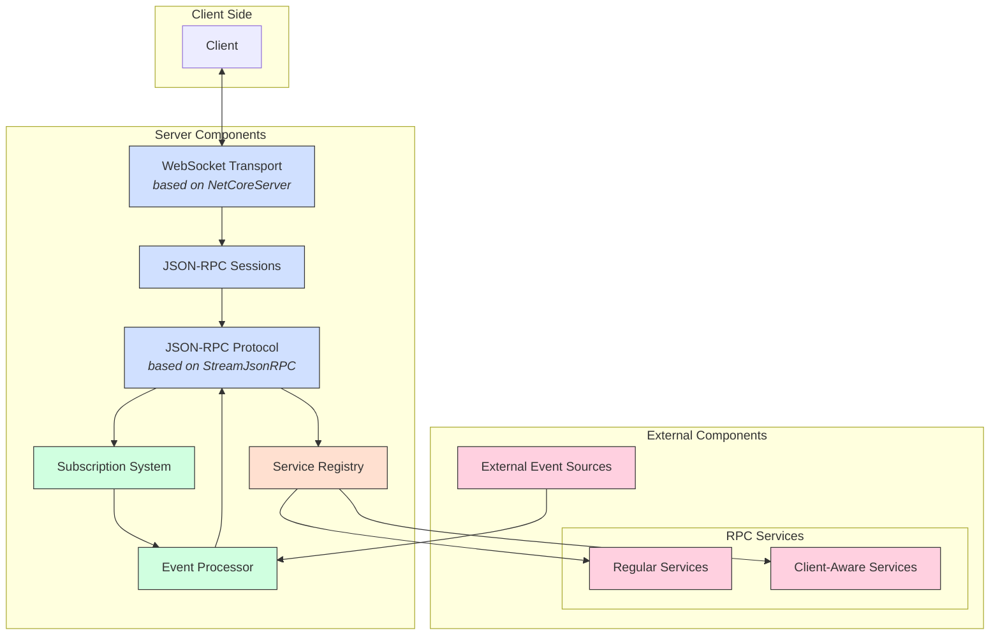

# WsRpcServer

  

[](LICENSE) [](https://dotnet.microsoft.com/download/dotnet/10.0)
[](https://github.com/07artem132/JSON-RPC.NET/actions/workflows/build.yml)

🔥 **WsRpcServer** — високопродуктивний WebSocket-фреймворк для двобічних JSON-RPC сервісів. Абстрагує все, окрім бізнес-логіки.


## 📖 Зміст

- [Про проект](#-про-проект)
- [Документація](#-документація)
- [Особливості](#-особливості)
- [Вимоги](#-вимоги)
- [Встановлення](#-встановлення)
- [Посібник з упровадження](#-посібник-з-упровадження)
- [Архітектура](#-архітектура)
- [Компоненти](#-компоненти)
- [Інтерфейси бібліотеки](#-інтерфейси-бібліотеки)
- [Обробка помилок](#-обробка-помилок)
- [Залежності](#-залежності)
- [Плани розвитку](#️-плани-розвитку-roadmap)
- [Ліцензія](#-ліцензія)

---

## 📱 Про проект

**WsRpcServer** — це фреймворк для розробки кросплатформенних 🔥 blazing-fast JSON-RPC сервісів. Заснований на [NetCoreServer](https://github.com/chronoxor/NetCoreServer) для транспортного рівня та [StreamJsonRpc](https://github.com/Microsoft/vs-streamjsonrpc) для роботи з протоколом JSON-RPC.

Це повноцінний фреймворк для побудови високопродуктивних двобічних JSON‑RPC сервісів через WebSocket. Він абстрагує транспорт, протокол та життєвий цикл клієнтів, дозволяючи зосередитися на бізнес‑логіці.

Фреймворк складається з пʼяти шарів:
1. Transport Layer — WebSocket з NetCoreServer.
2. Protocol Layer — JSON‑RPC 2.0 із StreamJsonRpc.
3. Session Layer — керування підключеннями клієнтів.
4. Service Layer — реєстрація та виклик RPC‑методів.
5. Subscription Layer — система підписок та сповіщень. 

## 📚 Документація

Поглиблений per-тип reference (точки розширення, інваріанти, приклади) живе у [`docs/`](docs/README.md):
[композиція+конфіг](docs/api/composition-and-config.md) ·
[сервер+сесія](docs/api/server-and-session.md) ·
[сервіси+реєстр](docs/api/services-and-registry.md) ·
[підписки](docs/api/subscriptions.md) ·
[події](docs/api/events.md) ·
[помилки](docs/api/errors.md) ·
[end-to-end приклад](docs/examples/echo-server.md) ·
[Native-AOT](docs/aot.md).

## 🚀 Особливості

- 🚀 **Висока продуктивність** — Асинхронна комунікація з ефективним транспортним шаром
- 📦 **JSON-RPC протокол** — Повна підтримка специфікації JSON-RPC 2.0
- 📡 **Обробка подій з системою підписок** — Надійна система обробки та доставки повідомлень
- 🧩 **Реєстр сервісів** — Автоматичне виявлення та реєстрація RPC-сервісів
- 👤 **Контекст клієнта** — Підтримка клієнт-залежних сервісів зі зберіганням стану

## 🔧 Вимоги

- **.NET 10.0** або новіше — [Завантажити](https://dotnet.microsoft.com/download/dotnet/10.0)

## 📦 Встановлення
> Публікація ведеться через [організацію 07artem132](https://github.com/07artem132)

1. 🔐 Додайте джерело пакета GitHub Packages:
 ```bash
dotnet nuget add source "https://nuget.pkg.github.com/07artem132/index.json" 
   --name github 
   --username USERNAME 
   --password GITHUB_TOKEN 
   --store-password-in-clear-text
   ```
2. 📦 Додайте сам пакет до свого проєкту:

```bash
dotnet add package WsRpcServer
```
> ⚠️ **Зверніть увагу**  
> Без додавання джерела з GitHub цей пакет не буде доступний.

## 📚 Посібник з упровадження

### 0. Створення проєкту та підключення пакету

```bash
# 1. Створюємо консольний застосунок
dotnet new console -n MyRpcServer
cd MyRpcServer

# 2. Додаємо пакет WsRpcServer
dotnet add package WsRpcServer
```

### 1. Базовий сервер (Program.cs)

```csharp
using Microsoft.Extensions.DependencyInjection;
using Microsoft.Extensions.Logging;
using WsRpcServer.Core;
using WsRpcServer.Extensions;

var services = new ServiceCollection();
services.AddLogging(b => b.AddConsole().SetMinimumLevel(LogLevel.Debug));

// Бізнес-сервіс (крок 2 нижче)
services.AddSingleton<ICalculatorService, CalculatorService>();

// Композиційний корінь: усі 5 core-сервісів + сервер одним викликом (фінд H1).
// Конкретні типи визначені у кроках 2–6 нижче; повний код — docs/examples/echo-server.md.
services.AddJsonRpcCore<
    DemoJsonRpcServer,
    DemoJsonRpcSession,
    DemoEventProcessor,
    DemoSubscriptionManager,
    DemoServiceRegistry,
    ServerEventType,   // TEventType
    object>(           // TEventArgs
    o =>
    {
        o.Host = "0.0.0.0";
        o.Port = 9000;
    });

var provider = services.BuildServiceProvider();

// Старт вручну: спершу обробник подій, потім сервер.
var eventProcessor = provider.GetRequiredService<IEventProcessor>();
await eventProcessor.StartAsync(CancellationToken.None);

var server = provider.GetRequiredService<DemoJsonRpcServer>();
Console.WriteLine($"Сервер стартує на {server.Address}:{server.Port}");
server.Start();

Console.WriteLine("Натисніть Enter для зупинки…");
Console.ReadLine();

server.Stop();
await eventProcessor.StopAsync(CancellationToken.None);
```

### 2. Створення RPC‑сервісів

```csharp
public interface ICalculatorService : IRpcService
{
    Task<int> Add(int a, int b);
    Task<int> Subtract(int a, int b);
}

public class CalculatorService(ILogger<CalculatorService> logger) : ICalculatorService
{
    public Task<int> Add(int a, int b) => Task.FromResult(a + b);
    public Task<int> Subtract(int a, int b) => Task.FromResult(a - b);
}

services.AddSingleton<ICalculatorService, CalculatorService>();
```

### 3. Клієнт‑залежні сервіси

```csharp
public interface IDemoEventsRpc : IClientAwareRpcService
{
    Task<int> Subscribe(string topic, ServerEventType[] eventTypes, CancellationToken ct = default);
    Task<bool> Unsubscribe(int subscriptionId, CancellationToken ct = default);
}

// clientId інжектиться реєстром (не з DI) — один екземпляр на з'єднання.
public class DemoEventsRpcAdapter(
    ISubscriptionManager<ServerEventType, object> subs,
    Guid clientId) : IDemoEventsRpc
{
    public Task<int> Subscribe(string topic, ServerEventType[] eventTypes, CancellationToken ct = default) =>
        subs.Subscribe(clientId, topic, eventTypes, ct);

    public Task<bool> Unsubscribe(int subscriptionId, CancellationToken ct = default) =>
        subs.Unsubscribe(clientId, subscriptionId, ct);
}
```

### 4. Користувацький обробник подій

```csharp
public record SystemStatusEvent(string Status, DateTime Timestamp);

public class DemoEventProcessor : AbstractEventProcessor
{
    private readonly Timer _timer;

    public DemoEventProcessor(ILogger<DemoEventProcessor> logger) : base(logger) =>
        _timer = new Timer(_ => Publish(), null, TimeSpan.FromSeconds(5), TimeSpan.FromSeconds(10));

    private void Publish()
    {
        var status = new SystemStatusEvent($"Active clients: {ClientHandlers.Count}", DateTime.UtcNow);
        foreach (var id in ClientHandlers.Keys)
            NotifyClient(id, "onSystemStatus", status);
    }
}
```

### 5. Користувацький менеджер підписок

```csharp
public enum ServerEventType { SystemStatus, UserActivity }

public class DemoSubscriptionManager(ILogger<DemoSubscriptionManager> log, DemoEventProcessor ep)
    : AbstractSubscriptionManager<ServerEventType, object>(log, maxSubscriptionsPerClient: 10)
{
    private readonly Dictionary<Guid, HashSet<ServerEventType>> _map = new();

    // Реалізуємо лише *Core — база серіалізує мутації під OperationLock.
    // НЕ викликай публічний Subscribe зсередини *Core (семафор не реентрантний = дедлок).
    protected override Task<int> SubscribeCore(
        Guid clientId, string topic, IReadOnlyCollection<ServerEventType> types, CancellationToken ct)
    {
        if (!_map.TryGetValue(clientId, out var set)) _map[clientId] = set = new();
        foreach (var t in types) set.Add(t);
        return Task.FromResult(999);
    }

    protected override Task<bool> UnsubscribeCore(Guid clientId, int subscriptionId, CancellationToken ct) =>
        Task.FromResult(_map.Remove(clientId));

    protected override Task<bool> UpdateSubscriptionCore(
        Guid clientId, int subscriptionId, IReadOnlyCollection<ServerEventType> types, CancellationToken ct)
    {
        _ = SubscribeCore(clientId, string.Empty, types, ct);   // сусідній *Core напряму
        return Task.FromResult(true);
    }

    // Гарячий шлях читання — без замка.
    public override List<Guid> GetClientsForEvent(object args, ServerEventType eventType) =>
        _map.Where(kv => kv.Value.Contains(eventType)).Select(kv => kv.Key).ToList();
}
```

### 6. Користувацький сервер та сесія

```csharp
public class DemoJsonRpcServer(IPAddress addr, int port, IServiceProvider sp, ILogger<DemoJsonRpcServer> log)
    : AbstractJsonRpcServer(addr, port, sp, log)
{
    protected override WsSession CreateJsonRpcSession() =>
        ActivatorUtilities.CreateInstance<DemoJsonRpcSession>(ServiceProvider, this);
}

// Базовий ctor сесії: (WsServer server, ILogger logger, JsonRpcServerConfig config).
// Решту залежностей (реєстр, обробник подій) додай параметрами — їх підставить
// ActivatorUtilities. Повний OnWsConnected/OnWsDisconnected — docs/examples/echo-server.md.
public sealed class DemoJsonRpcSession(
    WsServer server,
    ILogger<DemoJsonRpcSession> logger,
    IServiceProvider serviceProvider,
    IRpcServiceRegistry registry,
    IEventProcessor eventProcessor,
    JsonRpcServerConfig config)
    : AbstractJsonRpcSession(server, logger, config)
{
    // Перевизначте OnWsConnected / OnWsReceived / OnWsDisconnected.
}
```

---

## 🏗 Архітектура
Архітектура бібліотеки складається з наступних компонентів:

- **WebSocket Transport** - Низькорівнева обробка WebSocket з'єднань (на базі NetCoreServer)
- **JSON-RPC Protocol** - Шар підтримки JSON-RPC (на базі StreamJsonRpc)
- **JSON-RPC Sessions** - Управління сесіями клієнтів
- **Service Registry** - Реєстр доступних RPC-сервісів
- **Subscription System** - Система управління підписками клієнтів
- **Event Processor** - Обробник подій та їх доставка підписаним клієнтам



## 🧩 Компоненти

### 📡 JSON-RPC сесії

JSON-RPC сесії управляють з'єднаннями з клієнтами:

| Функція | Опис |
|---------|-------|
| SendNotificationAsync | Відправка сповіщення клієнту |
| SendBinaryDataAsync | Відправка бінарних даних |
| Close | Закриття WebSocket з'єднання |

### 📋 Система підписок

Система підписок дозволяє клієнтам підписуватись на конкретні події:

| Функція | Опис |
|---------|-------|
| Subscribe | Створення підписки на події |
| Unsubscribe | Скасування підписки |
| UpdateSubscription | Оновлення існуючої підписки |
| GetClientsForEvent | Отримання клієнтів для певної події |

### 📨 Обробка подій

Обробник подій відповідає за доставку повідомлень клієнтам:

| Функція | Опис |
|---------|-------|
| RegisterClient | Реєстрація клієнта для отримання сповіщень |
| UnregisterClient | Скасування реєстрації клієнта |
| StartAsync | Запуск обробника подій |
| StopAsync | Зупинка обробника подій |

### 🔍 Реєстр сервісів

Реєстр сервісів автоматично виявляє та реєструє RPC-сервіси:

| Функція | Опис |
|---------|-------|
| RegisterServices | Реєстрація сервісів у JSON-RPC |
| GetTargetAssemblies | Отримання збірок для сканування |
| IsTargetAssembly | Перевірка чи збірка містить RPC-сервіси |
| BuildServiceTypeCache | Побудова кешу типів сервісів |

## 🧰 Інтерфейси бібліотеки

Взаємодія з бібліотекою відбувається через такі основні інтерфейси:

### IJsonRpcSession

Інтерфейс для JSON-RPC сесій:

```csharp
public interface IJsonRpcSession
{
    Guid Id { get; }
    Task SendNotificationAsync(string method, params object[] args);
    Task SendBinaryDataAsync(ReadOnlyMemory<byte> data);
    void Close(WebSocketCloseStatus status, string reason);
}
```

### ISubscriptionManager

Інтерфейс для управління підписками:

```csharp
public interface ISubscriptionManager<TEventType, TEventArgs> : IDisposable
{
    Task<int> Subscribe(Guid clientId, string topic, IReadOnlyCollection<TEventType> eventTypes, CancellationToken cancellationToken = default);
    Task<bool> Unsubscribe(Guid clientId, int subscriptionId, CancellationToken cancellationToken = default);
    Task<bool> UpdateSubscription(Guid clientId, int subscriptionId, IReadOnlyCollection<TEventType> eventTypes, CancellationToken cancellationToken = default);
    List<Guid> GetClientsForEvent(TEventArgs args, TEventType eventType);
}
```

### IEventProcessor

Інтерфейс для обробки подій:

```csharp
public interface IEventProcessor
{
    Task StartAsync(CancellationToken cancellationToken);
    Task StopAsync(CancellationToken cancellationToken);
    void RegisterClient(Guid clientId, Func<string, object[], Task> notificationHandler);
    void UnregisterClient(Guid clientId);
}
```

### IRpcServiceRegistry

Інтерфейс для реєстру сервісів:

```csharp
public interface IRpcServiceRegistry
{
    void RegisterServices(JsonRpc jsonRpc, Guid clientId);
}
```

### IClientAwareRpcService

Інтерфейс для клієнт-залежних сервісів:

```csharp
public interface IClientAwareRpcService : IRpcService
{
}
```

## ⚠️ Обробка помилок

Викидайте `RpcErrorException` для структурованої відповіді клієнту:

```csharp
throw new RpcErrorException(
    JsonRpcErrorCode.InvalidParams,
    "Невірний формат параметра",
    new { Field = "date", ExpectedFormat = "yyyy-MM-dd" });
```

## 📚 Залежності

| Пакет | Призначення |
|-------|-------------|
| NetCoreServer | Високопродуктивний WebSocket транспорт |
| StreamJsonRpc | Реалізація JSON‑RPC 2.0 |
| Microsoft.Extensions.* | DI, Logging, Options |
| System.Threading.Channels | Асинхронні черги |

## 🗺️ Плани розвитку (Roadmap)

Фреймворк планує розвивається, і ось деякі плани на майбутнє:

- **Авторизація та аутентифікація** - Впровадження механізмів безпеки та контролю доступу
- **Аналітика та моніторинг** - Розширені можливості для спостереження та аналізу продуктивності

## 📜 Ліцензія

Доступно за ліцензією MIT.
---
> **Розроблено з ❤️ для .NET-спільноти та ЗСУ**.
> Якщо виникли запитання чи є ідеї — створюйте Pull Request або Issue!